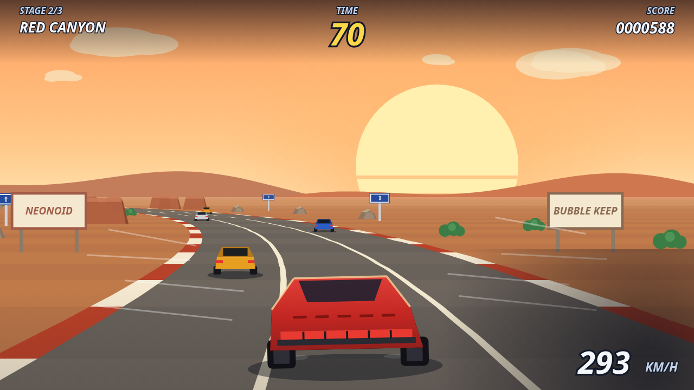
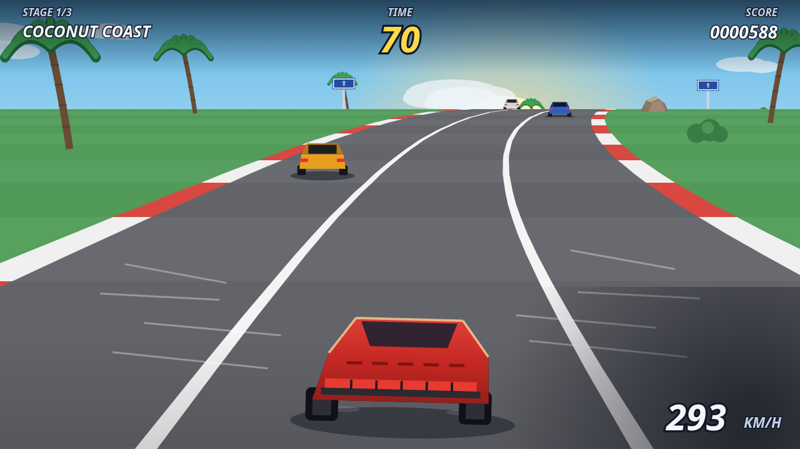
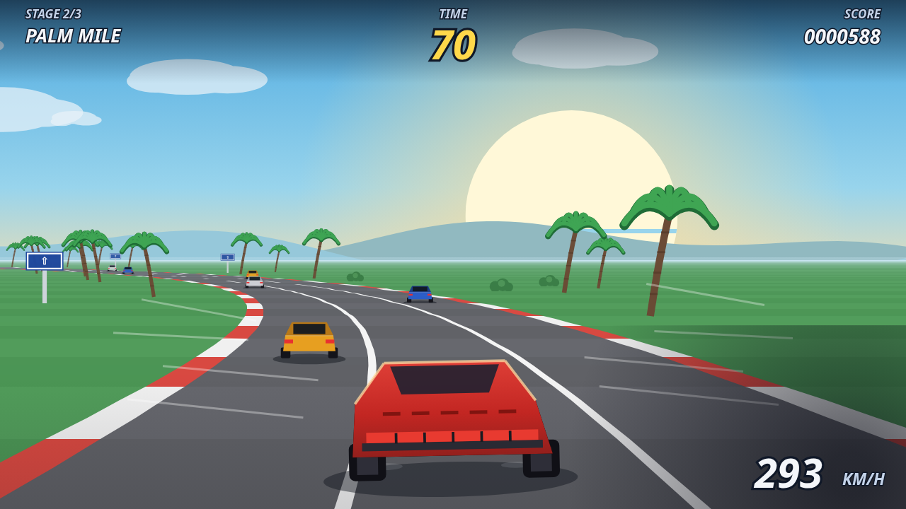
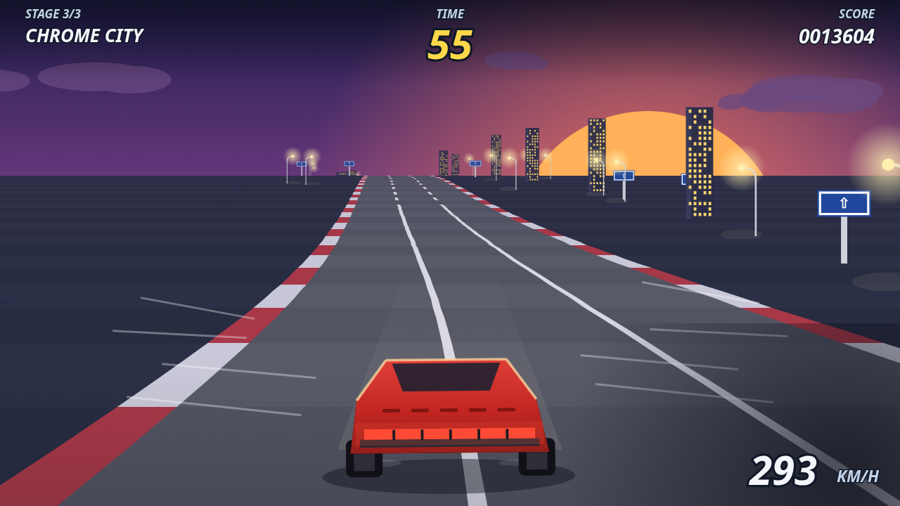
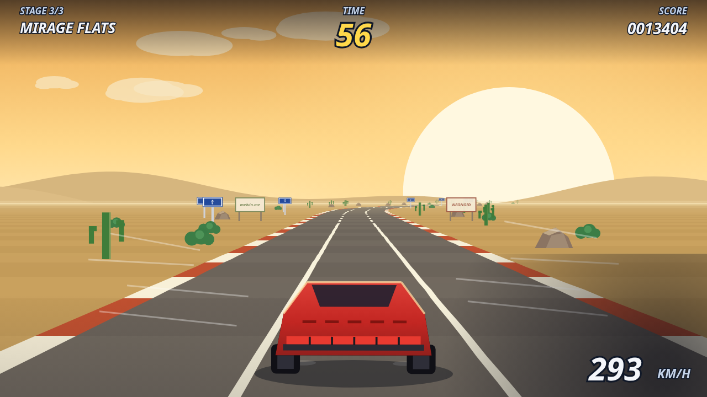

# SUNSTRIP

**An OutRun tribute built by a harsh-critic agent loop — pseudo-3D coastal
highway, branching stages, radio synth, and a machine-verified core.**
Zero assets, all code. Not neon: the real OutRun register — sunset gradients,
sea, palms, chrome and asphalt.

**Play it: https://melvincarvalho.github.io/sunstrip/**



## The game

Drive west until the sun gives out. Three stages per run through a branching
pyramid of six routes — every stage ends in a fork, and the gate you take
decides where you race next:

```
              COCONUT COAST
             /             \
       PALM MILE          RED CANYON
       /       \          /        \
  PINE RIDGE  CHROME CITY≡        MIRAGE FLATS
```

Checkpoints extend the clock. Traffic wants your paint. Grass wants your
speed. The sun sinks lower and swells larger with every stage.

- **◄ ►** steer · **▼** brake · auto-accelerate · **M** mute
- Radio dial on the title screen: three in-code synth stations
  (Sunset Cruise / Chrome Rush / Mirage FM)
- Pass bonus 500, checkpoint +42s, goal banks 1000 × every second left

## How it was built

One owner wrote the whole game, then looped three harsh sub-agent critics —
composition/color, game-feel juice, HUD/typography — against deterministic
screenshots, grading against the commercial bar (OutRun 2006, Horizon Chase
Turbo). Defects tagged FRAME-RUINING / MAJOR / MINOR, concrete fixes applied
as a single owner, re-captured, re-scored, until the score plateaued.
The prompt that produced all of this is in [prompt.md](prompt.md).

## The proofs

The simulation is a pure importable core ([core.js](core.js)) with no DOM
access: road geometry, projection, physics, traffic, the stage tree, the
clock. Twenty-four machine-verified proofs pin it down:

```
node proofs.mjs     # 24/24 — projection invariants, curve/hill continuity,
                    # determinism from seed, collision, clock and score maths
node mutants.mjs    # 16/16 — deliberate bugs injected into the core,
                    # every one caught by the suite
```

The mutant gate is the part that keeps the proofs honest: a frozen clock, a
consequence-free crash, a flipped centrifugal force, a silently shortened
stage — each mutation must make at least one proof fail, or the gate fails.

## Screenshots

Reproducible via `tools/capture.sh` — every scene is seeded and stepped
deterministically, so critics always argue about the same pixels.

| | |
|---|---|
|  |  |
|  |  |

## License

MIT
