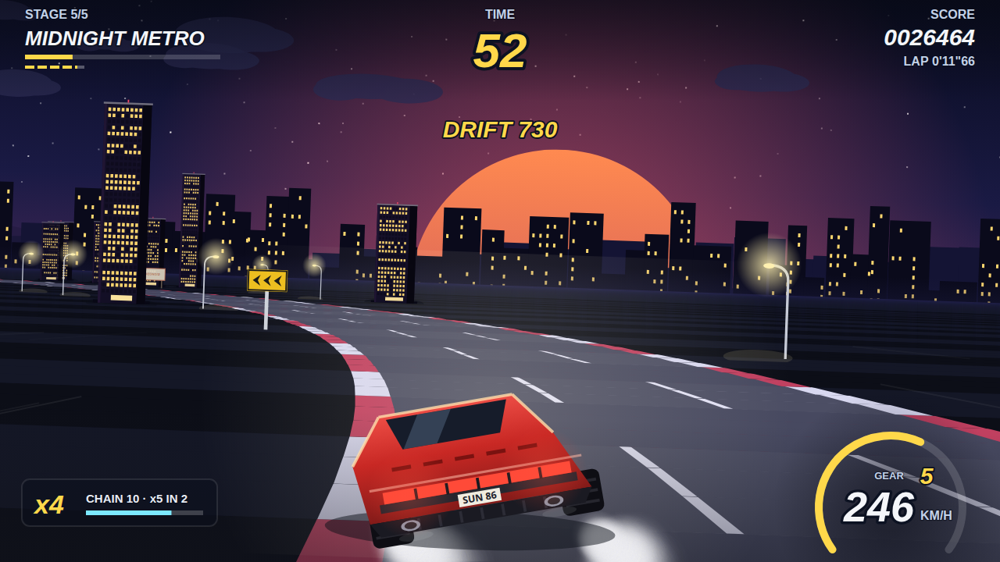
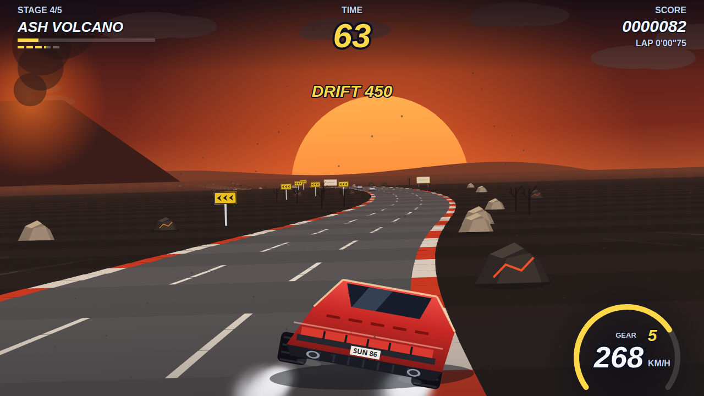
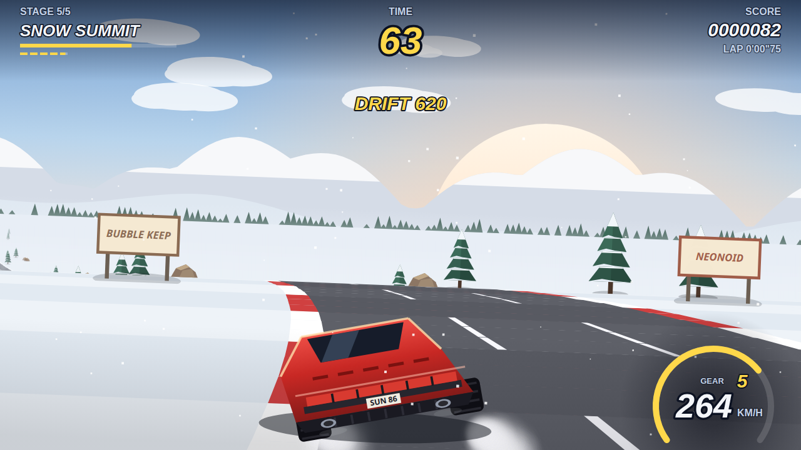
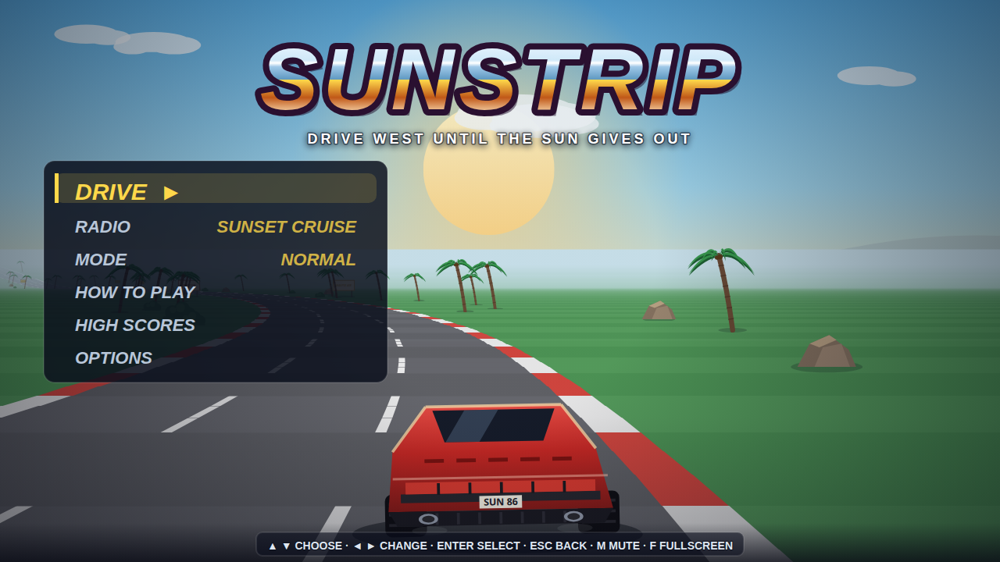
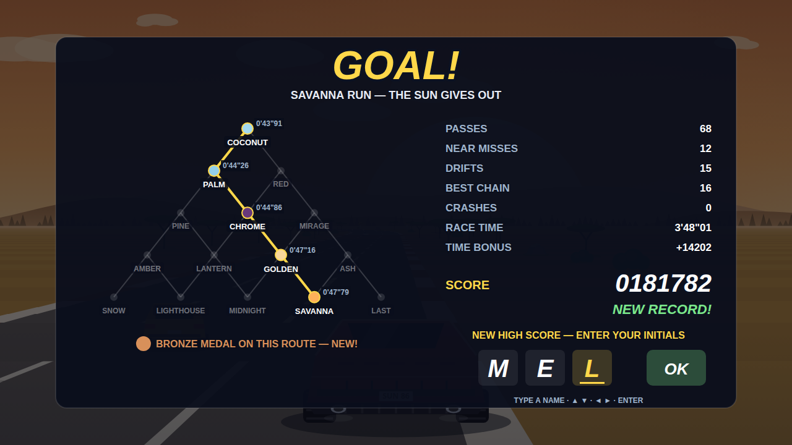

# SUNSTRIP

**An OutRun tribute: a pseudo-3D arcade road race across fifteen stages and
one long sunset. Pick your fork, beat the clock, drift the hairpins, tuck into
a slipstream and chain your near misses. Zero assets, all code.**

**Play it: https://melvincarvalho.github.io/sunstrip/**


## The game

Drive west until the sun gives out. Every run is five stages through a
fifteen-stage pyramid. Each stage ends in a fork, and the side of the road
you're on when you reach the gantry decides where you race next:

```
                        COCONUT BEACH
                      /               \
               PALM MILE            RED CANYON
              /         \          /          \
      PINE RIDGE      CHROME CITY          MIRAGE FLATS
       /      \        /      \           /          \
  AMBER VALLEY  LANTERN HARBOR  GOLDEN FIELDS      ASH VOLCANO
    /     \        /     \        /      \          /       \
 SNOW   LIGHTHOUSE   MIDNIGHT        SAVANNA           LAST
SUMMIT     BAY        METRO            RUN             LIGHT
```

Left-hand roads are calmer and give you more time. Right-hand roads are
busier and pay more. The light moves through a single day, from noon at the
beach to night in the city, and the sun sinks lower and swells larger with
every stage.

- **Beat the clock.** Checkpoints extend it, but only part of any time you've
  banked carries over, so every stage stays a race.
- **Lift in the bends.** At top speed the tight corners pull harder than your
  tyres can grip. Ease off or run wide.
- **Drift.** Tap the brake while turning hard at speed and hold the slide.
  It's the fastest line through a hairpin, and it scores when you're in a
  real bend. A crash loses the drift's points.
- **Chain.** Passes build a chain, and near misses (a real brush) count
  double. The multiplier climbs to x5, and a crash breaks it.
- **Slipstream.** Tuck in behind a car that's nearly as fast as you to get a
  tow past top speed. Pass the car that towed you for a slingshot bonus.
- **Don't hit the scenery.** Palms, signs, rocks and towers are solid.

Controls: **▲/W** accelerate · **◄ ►** steer · **▼/Space** brake ·
**Esc/P** pause · **M** mute · **F** fullscreen. On a gamepad, RT/A
accelerates, LT/X brakes and the stick steers. On touch, the throttle is
automatic and you get on-screen steer and brake pads.

Traffic is fixed per route, arcade style, so a score measures driving rather
than luck. There are three difficulties with a separate high-score table for
each, arcade initials, gold/silver/bronze medals for each of the 16 routes,
per-road best splits you race against, three in-code radio stations,
reduced-motion support, and an attract mode where the autopilot drives behind
the title.

## The code

| file | what |
|---|---|
| `core.js` | the pure simulation, with no DOM: road geometry, projection, physics, traffic, the stage tree, the clock and scoring |
| `bot.js` | the autopilot that drives the attract mode and the balance proofs |
| `game.js` | rendering, HUD, menus, input (keyboard, gamepad, multitouch), particles and the state machine |
| `art.js` | the 15 palettes and every sprite, drawn from canvas primitives |
| `audio.js` | a WebAudio synth: engine and gearbox, tyres, wind, traffic, sfx, and the three radio stations |

## The proofs

The simulation is pinned down by machine-checked proofs:

```
node proofs.mjs     # 57/57: projection, road continuity, the 15-stage tree,
                    # traffic that telegraphs, queues and never walls you in,
                    # collisions at the car's drawn depth, drift / chain /
                    # slingshot scoring rules (one event per pass, no farms),
                    # carry-over clock maths, route trade-offs, and balance
                    # (Easy is kind, Normal is winnable, Hard rewards skill)
node mutants.mjs    # 50/50: deliberate bugs injected into the core,
                    # every one caught by the suite
```

The mutant gate keeps the proofs honest. Each mutation must make at least
one proof fail, or the gate fails. The mutations include a frozen clock, a
consequence-free crash, scenery made of air, drift points paid on straights,
collisions moved back to the camera, and a clock made far too generous.

## How it was built

Harsh sub-agent critics with four lenses scored it out of 100 against the
commercial bar (OutRun 2006, Horizon Chase Turbo, Slipstream): gameplay
design, game feel and audio, visual art and HUD, and production readiness.
Each round the critics measured the game with headless play, deterministic
screenshots and node simulations, and checked whether each claimed fix had
actually landed. A single owner applied the fixes, re-ran the proofs and sent
it back. The original prompt is in [prompt.md](prompt.md).

Screenshots are reproducible: `index.html?shot=<name>` renders one seeded,
deterministic frame (`title hero palms canyon pines dusk desert autumn harbor
fields volcano snow bay metro savanna lastlight fork traffic results pause
touch spin1 wreck1 …`).

| | |
|---|---|
|  |  |
|  |  |
|  |  |

## License

MIT
